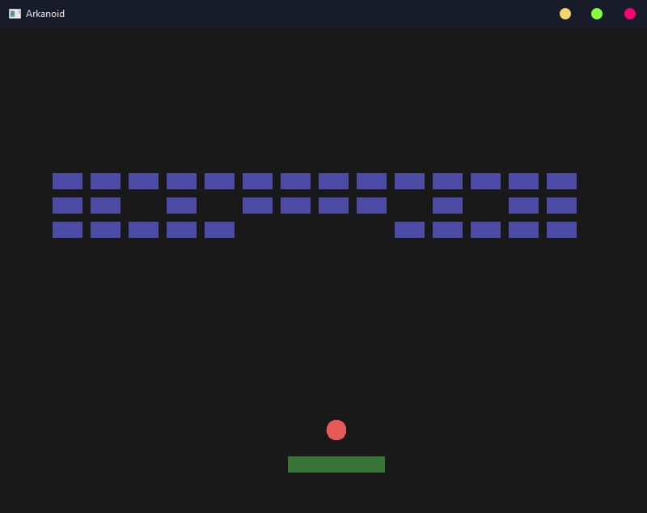

Arkanoid
====================

Simple OpenGL Arkanoid game.

  - platform moving left\right by keyboard
  - ball bounces out of walls, platform and top side
  - bottom side is endgame
  - bricks generates randomly on the start



## Build

> Requires C++17

```
git clone --recursive https://github.com/IgorKhramtsov/Arkanoid.git
cd Arkanoid
mkdir build
cd build 
cmake ..
make # your build command dependent on platform
```

## Dependencies

 - [glfw](https://github.com/glfw/glfw)
 - [glew](https://github.com/nigels-com/glew)
 - [glm](https://github.com/g-truc/glm)

 ## Progress

 1. [X] Project initialization (cmake)
 2. [X] Creating a window (glfw)
 3. [X] Drawing (glew, glm)
 4. [X] Input control
 5. [X] Collisions
 6. [X] Game logic
 7. [X] Effects

 ## Known Bugs

 1. Physics: Ball bounces incorrectly in some circumstances.